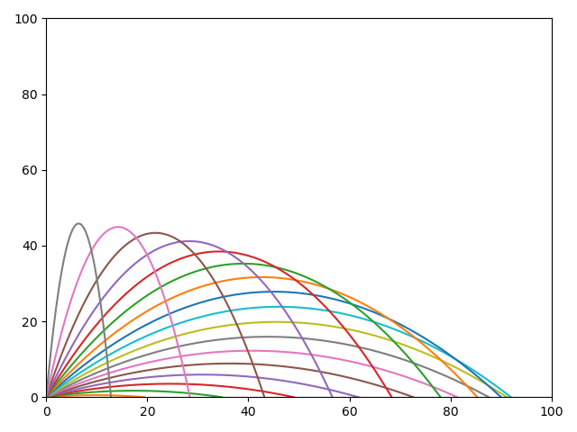

# Projectile modelling
In this project, I used **Python** to model the tragectory of a projectile.

[Source code](https://github.com/mrbrianevans/projectile-modeling/blob/master/projectile_modelling.py)

I used the SUVAT system of equations to calculate the projectiles position at a set time interval. 
The accuracy of the tradgectory depends on the time interval used to calculate its position.

  This is a particle fired at an initial velocity of 30ms-1 at every angle from 0&deg; to 90&deg; with intervals of 5&deg;
   
  

  To run your own simulations, you can download the source code in Python.
  I have included multiple functions, for modeling and testing differenct projection velocities and angles. 

  All the visuals are generated using matplotlib.pyplot

